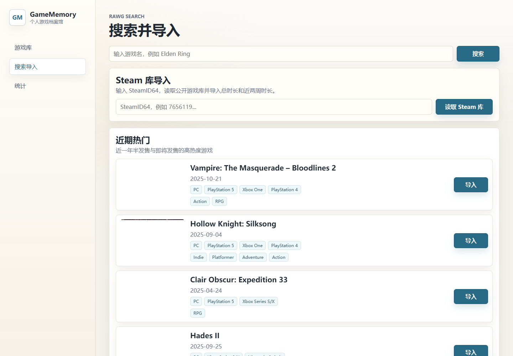
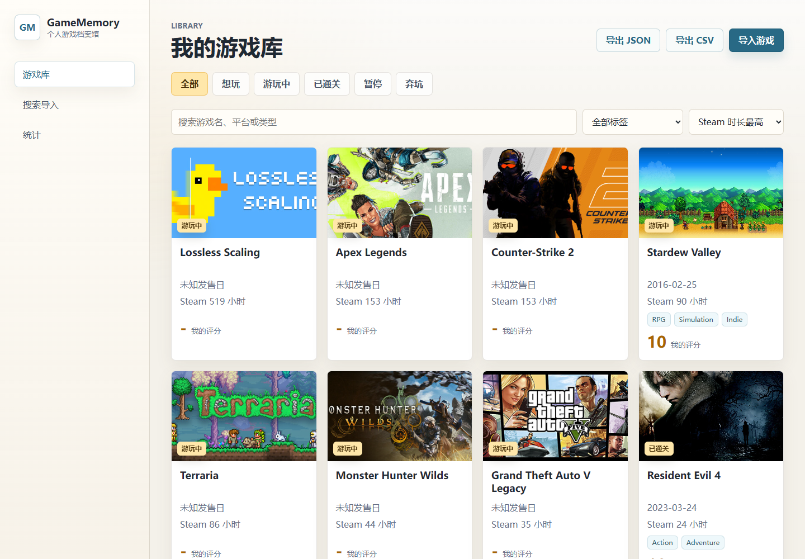
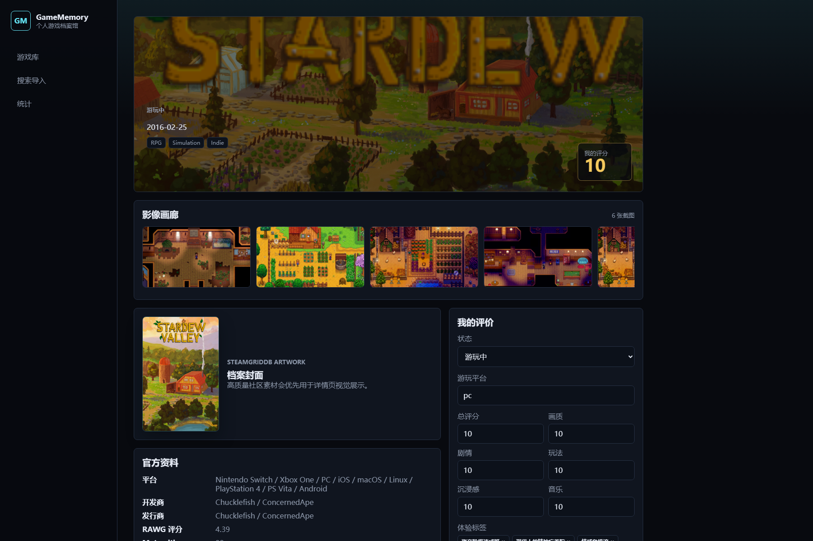
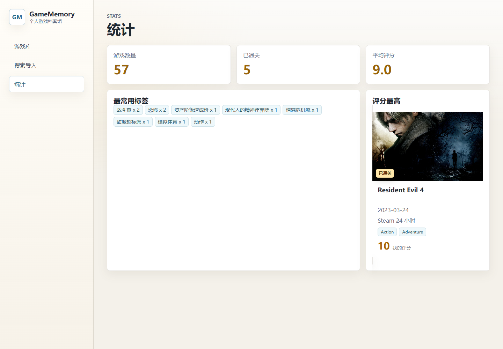

# GameMemory

<p>
  <a href="README.md"></a>
  <a href="README.zh.md"></a>
</p>

> A personal full-stack game archive for searching, importing, rating, tagging, reviewing, sharing memories, and exporting your collection.


## Overview

**GameMemory** is a full-stack personal game archive. It lets you search games through RAWG, import official metadata, enrich detail pages with SteamGridDB artwork, record your play status and ratings, write personal reviews, browse library statistics, and leave public Memory Wall comments on game detail pages.

The current production version uses:

- **Vue 3 + Vite** for the frontend
- **Netlify Functions** for the production API
- **Supabase PostgreSQL** for game and comment data
- **Supabase Storage** for Memory Wall images
- **Steam Web API** for owned-library import and playtime data
- **RAWG API** for game search, metadata, screenshots, and trailers
- **SteamGridDB API** for posters, heroes, and logos

The repository also keeps the earlier **Django + Django REST Framework + SQLite** backend for local learning and experimentation. The current online deployment does not use the Django backend.

## Live Demo

- Alibaba Cloud deployment: [Open GameMemory](http://47.109.136.234/projects/gamememory/)
- Alibaba Cloud API health check: [Open API health check](http://47.109.136.234/projects/gamememory/api/health)
- Production site: [Open GameMemory](https://1gamememory1.netlify.app)
- API health check: [Open API health check](https://1gamememory1.netlify.app/api/health)
- Static UI demo: [Open static UI demo](https://1379475267-svg.github.io/GameMemory/)

The Alibaba Cloud and Netlify versions connect to the real API and Supabase database. The GitHub Pages version is only a static interface preview.

## Screenshots

### Search And Import



### Game Library



### Game Detail



### Statistics



## Features

- Search games with RAWG API.
- Show recent high-interest games on the search page.
- Import games into the archive stored in Supabase.
- Import a public Steam library by SteamID64.
- Store Steam AppID, total playtime, recent two-week playtime, and Steam store links.
- Browse games in a warm light archive-style interface.
- Filter games by status, search by keyword, filter by tags, and sort the library.
- Export the current library view as JSON or CSV.
- View official metadata, screenshots, stores, trailers, and SteamGridDB artwork.
- Choose SteamGridDB poster, hero, and logo artwork for detail pages.
- Edit play platform, overall score, graphics score, story score, gameplay score, immersion score, music score, tags, and review text.
- Delete games from the archive.
- View statistics: total games, completed count, average score, top tags, and highest-rated game.
- Leave anonymous Memory Wall comments on each game detail page.
- Attach one image to each Memory Wall comment, uploaded through the server-side API to Supabase Storage.
- Use optional manual comment moderation with `COMMENT_MODERATION_MODE=manual`.

## Memory Wall

Each game detail page includes a **Memory Wall** section.

Visitors can submit:

- nickname
- optional rating from 1 to 10
- message content
- optional image attachment

Image upload rules:

- one image per comment
- supported types: JPG, PNG, WebP
- frontend accepts images up to 5 MB and compresses them before upload
- server-side upload limit is 2 MB
- images are uploaded by Netlify Functions using server-side Supabase credentials
- frontend code never receives the Supabase service role key

The first image upload can create the Supabase Storage bucket automatically:

```text
comment-images
```

## Tech Stack

| Area | Technology | Description |
|---|---|---|
| Frontend | Vue 3, Vite, Vue Router | Main user interface |
| Production API | Netlify Functions | Serverless API under `/api/*` |
| Production Database | Supabase PostgreSQL | Stores games, reviews, and Memory Wall comments |
| Production Storage | Supabase Storage | Stores comment image uploads |
| Local Backend | Django, Django REST Framework | Legacy/local backend for learning |
| Local Database | SQLite | Used by the Django backend |
| Steam Library | Steam Web API | Owned games and playtime import |
| Game Data | RAWG API | Search, metadata, screenshots, trailers |
| Artwork | SteamGridDB API | Posters, heroes, logos |

## Architecture

```text
Browser
  |
  | Vue 3 + Vite frontend
  v
Netlify Site
  |
  | /api/*
  v
Netlify Functions
  |        \
  |         \---- RAWG API / SteamGridDB API
  |
  |---- Supabase PostgreSQL
  |
  `---- Supabase Storage
```

In production, the browser does not access Supabase tables directly. Database writes and image uploads go through Netlify Functions.

## Project Structure

```text
GameMemory/
|-- api/                         # Vercel-style serverless API modules
|-- backend/                     # Django + DRF local backend
|-- docs/                        # Screenshots and docs assets
|-- frontend/                    # Vue 3 + Vite frontend
|-- netlify/                     # Production Netlify Functions
|-- supabase/                    # Production database schema
|-- netlify.toml
|-- package.json
|-- render.yaml
|-- vercel.json
|-- README.md
`-- README.zh.md
```

## Production Deployment

Recommended deployment:

| Service | Purpose |
|---|---|
| Netlify | Vue frontend and serverless API |
| Supabase | PostgreSQL database and Storage |
| Steam / RAWG / SteamGridDB | External library data, game data, and artwork APIs |

### 1. Supabase Setup

Create a Supabase project, open **SQL Editor**, and run:

```text
supabase/schema.sql
```

The schema creates:

- `public.games`
- `public.game_comments`
- required indexes
- row level security policies
- service role permissions

Required Supabase values:

```text
SUPABASE_URL
SUPABASE_SERVICE_ROLE_KEY
```

`SUPABASE_SERVICE_ROLE_KEY` is highly sensitive. Store it only in server-side environment variables.

### 2. Netlify Setup

Import this GitHub repository into Netlify.

Build settings:

```text
Base directory:        leave empty
Build command:         npm run build
Publish directory:     frontend/dist
Functions directory:   netlify/functions
```

Required Netlify environment variables:

```text
SUPABASE_URL=https://your-project-id.supabase.co
SUPABASE_SERVICE_ROLE_KEY=your-supabase-service-role-key
RAWG_API_KEY=your-rawg-api-key
STEAM_API_KEY=your-steam-web-api-key
STEAMGRIDDB_API_KEY=your-steamgriddb-api-key
COMMENT_MODERATION_MODE=manual
```

`COMMENT_MODERATION_MODE` is optional. Set it to `manual` if new Memory Wall comments should be inserted as `pending` instead of immediately visible.

### 3. Verify Production

Open [your Netlify API health check](https://your-netlify-site.netlify.app/api/health).

Expected shape:

```json
{
  "status": "ok",
  "service": "GameMemory Netlify API",
  "rawg_api_key_configured": true,
  "steam_api_key_configured": true,
  "steamgriddb_api_key_configured": true,
  "supabase_configured": true
}
```

Then test:

1. Search for a game.
2. Import it.
3. Read a public Steam library by SteamID64.
4. Import selected Steam games and confirm playtime appears.
5. Open the game detail page.
6. Edit your review.
7. Choose artwork if available.
8. Add a Memory Wall comment.
9. Add a Memory Wall comment with an image.
10. Refresh the page and confirm data persists.

## Local Development

### Frontend Only

```powershell
cd frontend
npm install
npm run dev
```

Frontend URL: [open local frontend](http://127.0.0.1:5173)

In local Vite development, the frontend defaults to the Django API at [open local API](http://127.0.0.1:8000/api).

### Django Backend

```powershell
cd backend
py -m venv .venv
.\.venv\Scripts\python -m pip install -r requirements.txt
Copy-Item .env.example .env
.\.venv\Scripts\python manage.py migrate
.\.venv\Scripts\python manage.py runserver
```

Fill `backend/.env`:

```text
DJANGO_SECRET_KEY=change-me
DJANGO_DEBUG=True
DJANGO_ALLOWED_HOSTS=localhost,127.0.0.1
RAWG_API_KEY=your-rawg-api-key
STEAM_API_KEY=your-steam-web-api-key
STEAMGRIDDB_API_KEY=your-steamgriddb-api-key
```

Backend health check: [open local backend health check](http://127.0.0.1:8000/api/health/)

### Netlify-Style Build

From the repository root:

```powershell
npm install
npm run build
```

The root build command installs frontend dependencies and builds `frontend/dist`.

## Production API Routes

In production, API routes are handled by `netlify/functions/api.js`.

```text
GET    /api/health
GET    /api/games
POST   /api/games
GET    /api/games/:id
PATCH  /api/games/:id
DELETE /api/games/:id
GET    /api/games/search?q=elden%20ring
GET    /api/games/trending
POST   /api/games/import_rawg
GET    /api/steam/library?steamId=7656119...
POST   /api/steam/import
GET    /api/games/:id/media
GET    /api/games/:id/artwork
PATCH  /api/games/:id/artwork
GET    /api/comments?gameId=1
POST   /api/comments
POST   /api/comments/upload-image
GET    /api/stats
```

## Environment Variables

### Production

```text
SUPABASE_URL
SUPABASE_SERVICE_ROLE_KEY
RAWG_API_KEY
STEAM_API_KEY
STEAMGRIDDB_API_KEY
COMMENT_MODERATION_MODE
```

### Local Django Backend

```text
DJANGO_SECRET_KEY
DJANGO_DEBUG
DJANGO_ALLOWED_HOSTS
RAWG_API_KEY
STEAMGRIDDB_API_KEY
```

## Security Notes

- Do not commit real API keys or environment files.
- Store production secrets in deployment platform environment variables.
- `SUPABASE_SERVICE_ROLE_KEY` must only be used on the server side.
- The frontend does not access Supabase tables directly.
- Comment image uploads are validated by file type and size before being stored.
- Memory Wall comments include basic rate limiting and a honeypot field.
- If any secret key is exposed, rotate it immediately and update deployment environment variables.

## Troubleshooting

### `vite: not found` on Netlify

Netlify installs root dependencies by default, while Vite is installed inside `frontend`.

Use the root build script:

```text
npm install --prefix frontend && npm run build --prefix frontend
```

This is already configured in the root `package.json`.

### `TypeError: fetch failed` when loading the library

This is usually caused by an incorrect `SUPABASE_URL`.

Correct format: [your Supabase project URL](https://your-project-id.supabase.co)

Do not include `/rest/v1/`.

### `permission denied for table games`

Run this in Supabase SQL Editor:

```sql
grant usage on schema public to service_role;
grant all privileges on all tables in schema public to service_role;
grant usage, select on all sequences in schema public to service_role;
```

### Image comments fail to save

Check:

- `image_url` exists on `public.game_comments`
- Netlify has `SUPABASE_URL` and `SUPABASE_SERVICE_ROLE_KEY`
- the uploaded image is JPG, PNG, or WebP
- the uploaded image is 2 MB or smaller after compression
- the `comment-images` Storage bucket exists, or the service role key has permission to create it

### Health check is true but games still fail

`/api/health` only checks whether environment variables exist. It does not prove the Supabase URL and service role key are valid.

Use the [games API route](https://1gamememory1.netlify.app/api/games) to verify real database access.

## Roadmap

- [x] Vue 3 + Vite frontend
- [x] Django + DRF local backend
- [x] RAWG search and import
- [x] Steam library import and playtime display
- [x] SQLite local archive
- [x] Supabase production database
- [x] Netlify production deployment
- [x] SteamGridDB artwork integration
- [x] Recent high-interest games
- [x] Personal review editor
- [x] Statistics page
- [x] Memory Wall comments
- [x] Image attachments for Memory Wall comments
- [x] Better artwork selection controls
- [x] Tag search and advanced filters
- [x] Export archive data
- [x] Friendlier production error messages
- [x] Optional comment moderation workflow
- [ ] User authentication and private archives

## Author

**Haoran Fei**

Built as a personal full-stack game archive and learning project.

## License

No license has been specified yet.
